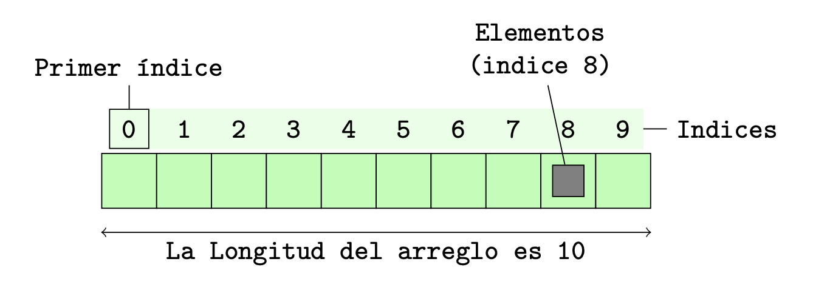

# Vectores

## ¿Qué situaciones nos ayudan a resolver los vectores?
Imaginemos que tenemos que guardar en un programa de C nuestras notas a lo largo del cuatrimestre, con lo que sabemos hasta ahora una solución sería:

```c
int nota_1 = 6;
int nota_2 = 8;
int nota_3 = 5;
int nota_4 = 7;
```
Algunos puntos negativos de este ejemplo son:

* Si tuviéramos que seguir agregando más notas deberíamos
hacerlo a mano y costaría más trabajo, además de que dejaría
**poco claro** el código.

* No permite recorrer automáticamente los datos. 

* Dificulta cálculos generales: para calcular el promedio habría que sumar variable por variable.

* Código repetitivo: se repiten estructuras muy similares.

## ¿Por qué necesitamos vectores en C?

* Permiten almacenar muchos valores del mismo tipo bajo un solo nombre.

* Facilitan el uso de estructuras repetitivas (`for`, `while`) para recorrer datos.

* Hacen el código más compacto y organizado.

* Permiten trabajar con cantidades variables de datos.

* Son la base para estructuras más complejas (matrices, estructuras dinámicas, etc.).

## ¿Qué es un vector en C?
Un vector (también llamado arreglo) es una estructura de datos que permite almacenar varios valores del **mismo tipo** bajo un único nombre.



En lugar de escribir:
```c
int nota_1 = 6;
int nota_2 = 8;
int nota_3 = 5;
int nota_4 = 7;
```
Podemos escribir:
```c
int notas[4] = {6,8,5,7} 
```
## Acceso a elementos 
En el ejemplo anterior tenemos:
```
Índice:   0    1    2    3
         -------------------
notas → |  6 |  8 |  5 |  7 |
         -------------------

```
Mediante los índices podemos acceder a cada uno de los elementos dentro del arreglo. 

Si quisiéramos acceder al número 7:

```c 
int nota_4 = notas[3];
```

> OBS: En C, el primer elemento siempre esta en la posición 0. 

```c 
int primera_nota = notas[0]; // nota: 6
```